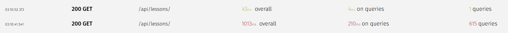
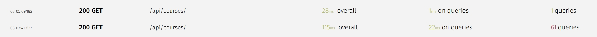

# Advanced Django ORM Lab — Project Summary

## Overview

This project is a hands‑on training lab focused on **performance‑oriented backend development using Django and Django REST Framework (DRF)**.
Instead of building simple CRUD endpoints, the main objective was to understand how relational data behaves in real systems and how to design APIs that remain efficient as database size grows.

The domain implemented is a **Learning Management System (LMS)** containing courses, modules, lessons, enrollments, and learning resources.

---

## Images



---
## Data Model (ERD Concept)

The database schema models a hierarchical educational platform:

* **Instructor** → owns many Courses
* **Course** → contains many Modules
* **Module** → contains many Lessons
* **Lesson** → contains many Resources
* **Enrollment** → links Users and Courses (students)

Additional relations:

* Course belongs to a Category
* Course has Training Options (Many‑to‑Many)
* Courses can have Live Sessions and Quizzes

This hierarchy was intentionally chosen because it is the classic source of database performance problems (especially the *N+1 query problem*).

---

## Performance Optimization

* Reduced query count using select_related

* Eliminated N+1 queries using prefetch_related

* Aggregated data using annotate and Count(distinct=True)

* Implemented dynamic serializer fields to avoid over-fetching

* Structured relationships to support efficient joins

---

## APIs Implemented

### 1) List Courses API

`GET /api/courses/`

Returns summarized course information including:

* category name
* instructor username
* number of modules
* number of lessons
* number of enrolled students
* total number of lesson resources

This endpoint required heavy ORM optimization due to multiple relations.

---

### 2) Course Details API

`GET /api/courses/<slug>/`

Provides detailed information for a single course while maintaining constant query count regardless of dataset size.

---

### 3) Course Curriculum API (Important)

`GET /api/courses/<slug>/curriculum/`

Nested response:

Course → Modules → Lessons

Each lesson returns:

* title
* duration
* number of resources

This endpoint was specifically designed to solve deep nested relational loading efficiently.

---

### 4) Lesson Navigation API

`GET /api/lessons/<id>/`

Returns:

* lesson details
* previous lesson
* next lesson

This simulates video‑player navigation in real e‑learning platforms.

---

## ORM Techniques Practiced

### 1. `select_related`

Used for **ForeignKey and OneToOne relationships**.

Purpose:
Load related objects using SQL JOINs in a single query.

Example:

```python
Course.objects.select_related('category', 'instructor', 'instructor__user')
```

Effect:
Without it → 1 query per course instructor
With it → 1 total query

---

### 2. `prefetch_related`

Used for **reverse relations and Many‑to‑Many relationships**.

Instead of JOINs, Django executes a second query and maps results in Python memory.

Example:

```python
Course.objects.prefetch_related('modules')
```

---

### 3. `Prefetch` Object (Advanced)

Allows customizing the queryset being prefetched.

Example:

```python
Prefetch('lessons', queryset=Lesson.objects.annotate(resources_count=Count('resources')))
```

This made it possible to attach aggregated data to each lesson without loading the resources themselves.

---

### 4. `annotate`

Adds computed database values to each row.

Example:

```python
.annotate(number_of_modules=Count('modules', distinct=True))
```

Practical meaning:
The database calculates values before they reach the serializer.
No Python loops required.

---

### 5. `Count` and `distinct=True`

When joining multiple tables, duplicate rows appear.
`distinct=True` ensures correct aggregation.

Example problem:
Course → Modules → Lessons

Without `distinct`, modules could be counted multiple times.

---

### 6. Nested Serializer Optimization

Instead of querying inside serializers (bad practice), all data preparation was moved to the queryset layer.

Principle learned:

> Serializers should represent data, not fetch data.

---

## The N+1 Query Problem

### Before Optimization

Fetching courses with modules and lessons produced:

* 1 query for courses
* N queries for modules
* N² queries for lessons
* N³ queries for resources

Example result:

```
61 SQL queries for a single request
```

---

### After Optimization

Using `select_related`, `prefetch_related`, `Prefetch`, and `annotate`:

```
4 SQL queries total
```

The query count became constant, independent of database size.

This is the core achievement of the project.

---

## Performance Results

| Metric        | Before | After      |
| ------------- | ------ | ---------- |
| Queries       | 61+    | 4          |
| Response Time | Slow   | Fast       |
| Scalability   | Poor   | High       |
| Memory Usage  | High   | Controlled |

The API is now suitable for large datasets and production environments.

---

## Key Lessons Learned

1. Database design directly affects API performance.
2. Serializers can silently cause major performance issues.
3. The ORM is powerful but dangerous if misunderstood.
4. Query count matters more than code elegance.
5. Aggregations should be done in the database, not Python.
6. Nested APIs require prefetching, not joins.

---

## Concepts Mastered

* QuerySet evaluation
* Lazy loading
* JOIN vs separate queries
* Aggregations
* Reverse relations
* Nested serialization
* Query optimization
* Scalable API design

---

## Future Learning Goals

Next advanced topics to practice:

* `Subquery` and `OuterRef`
* Window functions
* Conditional aggregation (`Case`, `When`)
* QuerySet caching strategies
* Database indexing strategies
* Pagination performance optimization
* User progress calculation inside queries

---

## Conclusion

This lab was not a CRUD tutorial.
It was a performance engineering exercise using Django ORM.

The final APIs return complex nested data structures while maintaining a **constant number of database queries**. The main achievement is understanding how to control database access patterns instead of letting the framework implicitly control them.

In practical terms, the system now behaves like a real production LMS backend rather than a development prototype.

## API Endpoints

The project exposes several REST endpoints built with Django REST Framework `APIView` classes:

* `GET /courses/` → Returns the list of courses with aggregated statistics (modules and lessons count) using optimized queries (`select_related`, `annotate`, `Count`, `distinct`).
* `GET /courses/<slug:slug>/curriculum/` → Returns the curriculum of a specific course (modules and lessons) using `prefetch_related` to avoid excessive queries.
* `GET /courses/<slug:slug>/` → Returns detailed information about a single course.
* `GET /lessons/` → Lists all lessons.
* `GET /lessons/<int:id>/` → Returns the details of a specific lesson.

These routes demonstrate separation of concerns between listing, details, and nested curriculum retrieval, each optimized according to the data access pattern.

## Dynamic Serializer Fields

To make serializers reusable and reduce response payload size, I implemented **dynamic serializer fields**. This allows the API to return only the fields required by a specific endpoint instead of always serializing the full model.

The serializer overrides `__init__` and accepts an optional `fields` argument:

```python
def __init__(self, *args, **kwargs):
    # Pop the optional "fields" argument
    fields = kwargs.pop('fields', None)

    # Instantiate normally
    super().__init__(*args, **kwargs)

    if fields is not None:
        # Drop any fields that are not specified
        allowed = set(fields)
        existing = set(self.fields.keys())
        for field_name in existing - allowed:
            self.fields.pop(field_name)
```

### Benefits

* Reduces response size (bandwidth optimization)
* Improves performance on list endpoints
* Allows the same serializer to be used for both list and detail views
* Provides flexible API design similar to field selection in GraphQL

Example usage:

* Course list endpoint → minimal fields (id, title, slug)
* Course detail endpoint → full course information
* Curriculum endpoint → nested modules and lessons only
